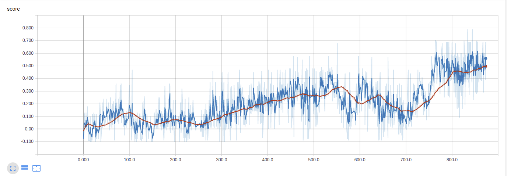
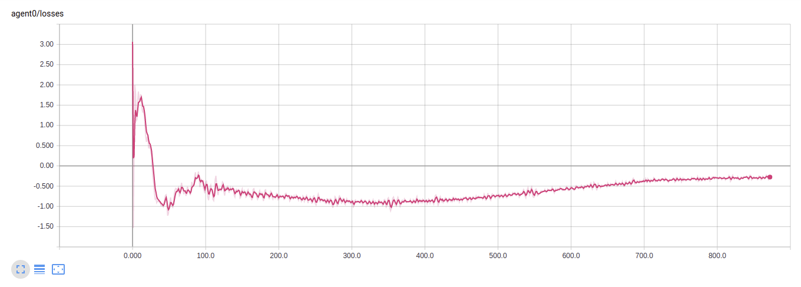
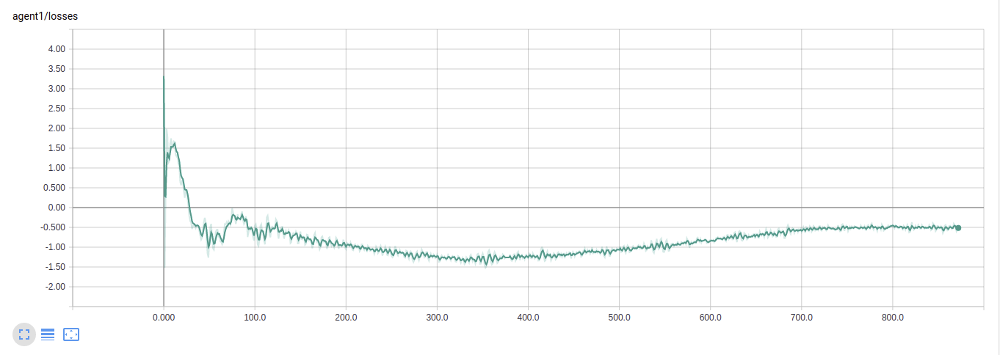
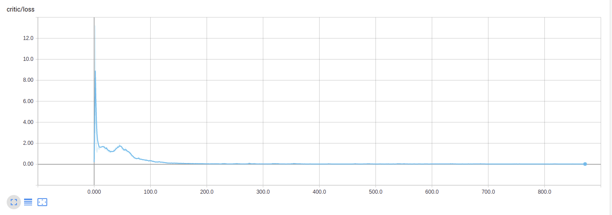

# Collaboration and Competition Project

This project submission solves the ML-Agents Tennis environment reaching an average mean score over 100 episodes of 0.5 in 1748 episodes. The Tennis environment is fully collaborative since the agents are incentivized to maintain the ball in play as long as possible.  An appropriate algorithm for this situation is Open AI's MADDPG which also works well in a continuous action space.

## Methods

The MADDPG source code was updated to work with ML-Agents by adapting the training script (`main.py`) through code contributions from the my previous Continuous Control project submission.  The actor and critic networks from the MADDPG lab codebase architecture of two hidden layers was conserved. Through various progressive cleanup steps (see [commit history](https://github.com/kaaloo/p3_collab-compet/commits/master)), a baseline version using the original hyperparameters able to run on CPU was obtained.  Getting the code to run on GPU required upgrading to the latest pytorch 1.7.1 and installing a cuda toolkit 11.1 compatible with the version nvidia cuda installed locally.  At this point, several refactoring operations where necessary on the code base to solve the Tennis environment.  Throughout this process several variants were tested which provided poor results.  

The design that was arrived at uses a single critic with access to full observations and two independent actor networks (see `agent.py`).  Although it could have been possible to use a single actor network for both agents, this could have resulted in some "forgetting" leading to slower learning. This agent module is a hybrid implementation specifically tuned to this cooperative environment and results from a refactoring and merging of the original `maddpg.py` and `ddpg.py` modules in the MADDPG Lab code base.

The initial version of this architecture was still performing poorly and so attention was turned to tuning hyperparameters.  The most important contributions from this tuning where to increase the number of steps per episode, to increase the size of the actor and critic networks.  A sweet spot was found after experimenting with 0.5 and 1.0 at 0.8 times the square of the input dimensions for the first hidden layer and half of that for the next one.  The noise level was also increased to a sweet spot of 4 after various trials and noise reduction was reduced from 0.9999 to 0.999995 to take into account the greater number of steps and introduce a bit more exploration early on. Other hyperparameters such as `batchsize` (1000) where kept essentially the same. Tensorboard sophisticated self-refreshing UI was used for all monitoring of analytic data (losses, scores) instead of printing results to the terminal.

Finally, lessons learned from the previous Continuous Control project where applied, namely batch normalization during replay and gradient clipping.

### Hyperparameters

The following table resumes the hyperparameters used in this submission.

Hyperparameter | Value | Comment
---------|----------|---------
 batchsize | 1000 |
 discount_factor | 0.95 |
 episode_length | 300 | This was boosted from the initial MADPPG Lab value to allow for longer play
 episodes_per_update | 2 | Learning took place every two episodes after the initial 1000 (batchsize) steps
 lr_actor | 1.0e-2 | Actor Adam optimizer learning rate
 lr_critic | 1.0e-2 | Critic Adam optimizer learning rate
 noise | 4 | Boosted from the original value of 2
 noise_reduction | 0.999995 | Boosted from the original value of 0.9999 allowing for more exploration during training
 number_of_episodes | 10000 | The training algorithm was programed to exit upon solving the environment
 tau | 0.02 | Slow rate of copy to target networks to reduce variance
 weight_decay | 1.e-5 | Critic Adam optimizer weight decay

### Critic Network Architecure

The critic used the following architecture.  An additional hidden layer (hidden1) was introduced when batch normalization was applied in order to batch normalize the state separately before concatenating the action value as input to hidden1.  This technique was used successfully in the Continuous Control project and thus applied again here.  An Adam optimizer with learning rate of 1.0e-2 and weight decay of 1.e-5 was used as in the MADPPG Lab.

Layer | Size
---------|----------
 input | state_size 
 hidden1 | state_size + action_size
 hidden2 | 0.8 * state_size + action_size ** 2 
 hidden3 | hidden2_size // 2
 output  | 1

### Actor Network Architecture

Two independent actor networks were used with the following architecture.  An Adam optimizer with learning rate of 1.0e-2 was used as in the MADPPG Lab.

Layer | Size
---------|----------
 input   | state_size 
 hidden1 | 0.8 * state_size ** 2
 hidden2 | hidden1_size // 2 
 output  | action_size

## Results

The agent solved the Tennis environment in 1748 episodes.  The following screenshots illustrate the episode (blue) and running mean over 100 episode (orange) scores, agent losses, and the critic loss.

### Episode and Running Mean Scores

### Agent Losses

These two losses should have been logged together so that they are displayed in the same graph.

### Critic Loss

## Future Work

Other algorithms were considered in the context of this project, in particular following our course work on DeepMind's AlphaZero, an attempt was made to identify a variant that could work with a continuous action space.  The difficulty here is that AlphaZero's MCTS does not readily translate from a discrete action space.  A promising candidate is [A0C - Alpha Zero in Continuous Action Space)](https://arxiv.org/pdf/1805.09613.pdf) which overcomes this difficulty by applying a progressive widening technique during MCTS.

## Sources

- [OpenAI's MADDPG Algorithm](https://towardsdatascience.com/openais-multi-agent-deep-deterministic-policy-gradients-maddpg-9d2dad34c82)
- [Deep Deterministic Policy Gradients Explained](https://towardsdatascience.com/deep-deterministic-policy-gradients-explained-2d94655a9b7b)
- Udacity Deep Reinforcement Learning MADDPG Lab Source Code (obtained by direct download of the workspace files)
- Hernandez-Leal, P., Kartal, B. and Taylor, M.E., 2019. [A survey and critique of multiagent deep reinforcement learning](https://arxiv.org/pdf/1810.05587.pdf). Autonomous Agents and Multi-Agent Systems, 33(6), pp.750-797.
- Lowe, R., Wu, Y.I., Tamar, A., Harb, J., Abbeel, O.P. and Mordatch, I., 2017. [Multi-agent actor-critic for mixed cooperative-competitive environments](https://papers.nips.cc/paper/2017/file/68a9750337a418a86fe06c1991a1d64c-Paper.pdf). In Advances in neural information processing systems (pp. 6379-6390).
- Moerland, T.M., Broekens, J., Plaat, A. and Jonker, C.M., 2018. [A0C: Alpha zero in continuous action space](https://arxiv.org/pdf/1805.09613.pdf). arXiv preprint arXiv:1805.09613.
